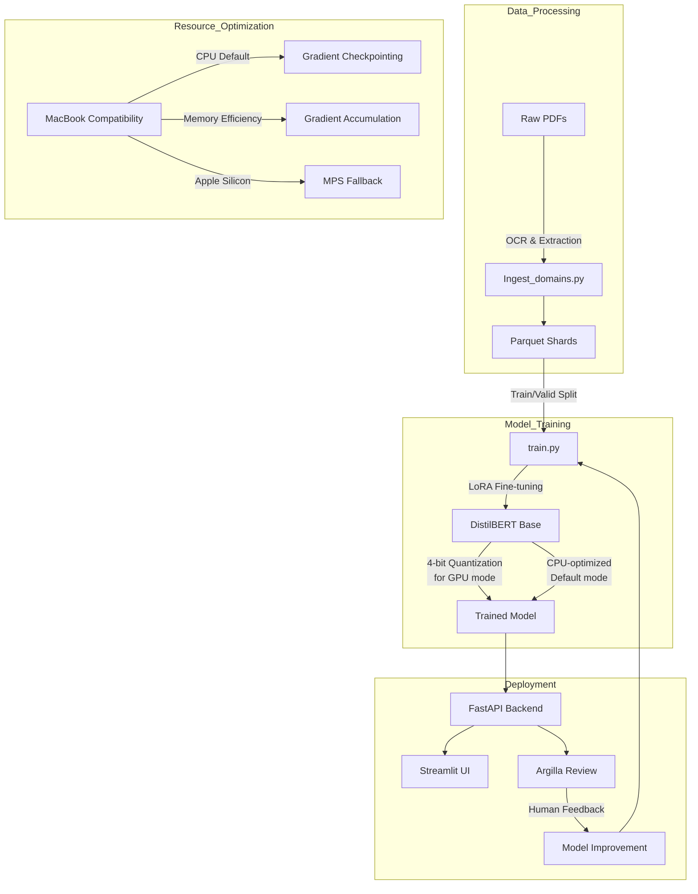

# DocTriage-BERT

**DistilBERT + LoRA + 4-bit** classifier for document domain identification (reports vs. regulations), optimized for resource-constrained environments.

## Overview

DocTriage-BERT ingests PDFs by domain, extracts text using Tesseract OCR, shards into Parquet, and fine-tunes a lightweight DistilBERT classifier with parameter-efficient LoRA adapters and 4-bit quantization. Includes end-to-end pipeline:

1. **Ingestion & OCR** (`src/ingest_domains.py`)
2. **Parquet Sharding** (`data/*.parquet`)
3. **Training** (`src/train.py`)
4. **Evaluation** (test split)
5. **Human-in-the-loop Review** with Argilla
6. **Inference API & Streamlit UI**

## System Architecture



## Small Dataset Strategy

Given the current limited dataset size (2 articles per domain), we've implemented a specialized approach to maximize model performance:

> **IMPORTANT NOTE FOR USERS:**  
> The datasets included in this repository are minimal placeholders intended only for demonstration purposes. For real-world applications, users are **strongly encouraged** to provide substantial domain-specific data (ideally 100+ documents per domain) to achieve reliable performance. The techniques implemented here are designed to work with limited data, but model accuracy, generalization, and reliability will be significantly improved with larger datasets. Academic and production use cases should collect appropriate amounts of domain-specific documents before deployment.

### 1. Model Architecture
- **DistilBERT Base**: 40% smaller than BERT while maintaining 97% of performance
- **LoRA Adapters**: Parameter-efficient fine-tuning (only 0.1% of parameters updated)
- **4-bit Quantization**: Memory optimization for GPU training

### 2. Data Augmentation Pipeline
```python
# Example augmentation techniques
- Synonym Replacement: Preserves domain-specific terminology
- Back Translation: Creates semantic variations
- Text Perturbation: Maintains document structure
```

### 3. Training Strategy
- **Cross-Validation**: 5-fold validation to maximize data usage
- **Gradient Accumulation**: Effective batch size of 16 (4 × 4)
- **Learning Rate**: 2e-5 with warmup for stable training
- **Early Stopping**: Prevents overfitting on small dataset

### 4. Validation Approach
- **Human-in-the-loop**: Argilla integration for manual review
- **Confidence Thresholds**: Higher thresholds for production use
- **Continuous Feedback**: Model improvement through user corrections

### 5. Limitations & Considerations
- **Dataset Size**: Current performance limited by small dataset
- **Generalization**: Model may not generalize well to new domains
- **Confidence**: Higher uncertainty in predictions
- **Future Improvements**: 
  - Collect more domain-specific data
  - Implement active learning
  - Expand to more document types

## Resource Budget Strategy
- **RAM:** 9 GB - 4-bit quantization + LoRA + gradient checkpointing + small batches
- **Disk:** 37 GB - Streaming HF Datasets + ONNX-lite export + tight Docker layering
- **CPU:** Mac M-series - device_map="auto", MPS fallback when available
- **Default Mode:** CPU-only for MacBook compatibility

## Using the Application

DocTriage-BERT provides three complementary services that work together seamlessly:

### 1. Streamlit UI (http://localhost:8501)
This is the main user interface where you can:
- Upload new PDF documents
- Get instant classification results (report vs. regulation)
- Visualize confidence scores
- View extracted text from documents
- Track classification history

**For typical users:** Start here to classify documents and interact with the system through a friendly web interface.

### 2. FastAPI Backend (http://localhost:8181)
This is the classification engine that:
- Provides the REST API powering the UI
- Handles document processing
- Runs the DistilBERT+LoRA model for predictions
- Stores results and manages uploaded files

**For developers:** Access API documentation at http://localhost:8181/docs to integrate with other systems.

### 3. Argilla (http://localhost:6900)
This is the human-in-the-loop review platform where you can:
- Review model predictions 
- Correct classifications that were wrong
- Provide feedback on confidence scores
- Help improve the model over time

**For data teams:** Use this interface to validate model outputs and provide feedback data for model improvement.

#### Workflow for End Users:
1. Upload documents through the Streamlit UI
2. Review classification results
3. For uncertain or incorrect predictions, use Argilla to provide feedback
4. As feedback accumulates, the model can be retrained for improved accuracy

---

## Quickstart

### Using the all-in-one script

The easiest way to set up and run the entire application is to use the provided `start.sh` script:

```bash
./start.sh
```

This script will:
1. Install dependencies (Colima, Docker)
2. Create necessary directories
3. Ingest and process documents
4. Train the model or select an existing model
5. Start all services

### Manual Setup

#### 1. Install Dependencies

```bash
pip install -r requirements.txt
```

#### 2. Prepare Data

Place domain-specific PDFs under:

```
raw/reports/*.pdf
raw/regulations/*.pdf
```

Then ingest:

```bash
python src/ingest_domains.py \
  --input-dir raw/ \
  --output-dir data/ \
  --domains reports regulations
```

#### 3. Split Train/Test

```bash
mkdir -p raw/test/{reports,regulations}
# move one PDF per domain into raw/test/
python src/ingest_domains.py \
  --input-dir raw/ \
  --output-dir data/train_valid/ \
  --domains reports regulations
python src/ingest_domains.py \
  --input-dir raw/test/ \
  --output_dir data/test/ \
  --domains reports regulations
```

#### 4. Train & Evaluate

```bash
# CPU mode (default, optimized for MacBooks)
python src/train.py \
  --model distilbert-base-uncased \
  --output_dir outputs/distil-lora-4bit \
  --epochs 3 \
  --batch_size 4 \
  --lr 2e-5

# GPU mode (if available)
python src/train.py \
  --model distilbert-base-uncased \
  --output_dir outputs/distil-lora-4bit \
  --epochs 3 \
  --batch_size 4 \
  --lr 2e-5 \
  --gpu
```

#### 5. Start Services

```bash
docker-compose up
```

#### 6. Access Services

- API: http://localhost:8181
- Streamlit UI: http://localhost:8501
- Argilla: http://localhost:6900

---

## Project Structure

```
├── raw/                  # source PDFs
├── data/                 # processed Parquet shards
│   ├── train_valid/      # train+validation shards
│   └── test/             # test shards
├── src/
│   ├── ingest_domains.py # PDF processing with Tesseract OCR
│   ├── train.py          # model training (CPU by default)
│   ├── api.py            # FastAPI backend
│   ├── app.py            # Streamlit UI
│   ├── log_for_review.py # Argilla integration
│   └── evaluate_review.py
├── outputs/              # model checkpoints
├── uploads/              # user uploaded files
├── start.sh              # all-in-one setup and deployment script
├── docker-compose.yml    # multi-container configuration
├── Dockerfile            # container definition
├── requirements.txt
└── README.md
```

